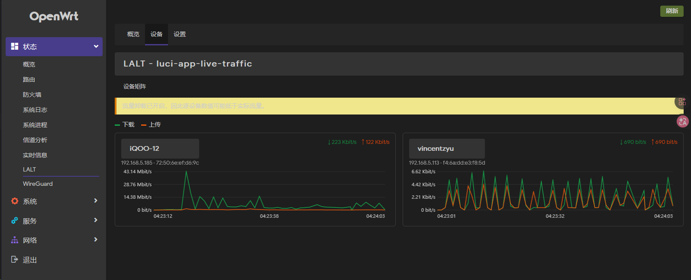
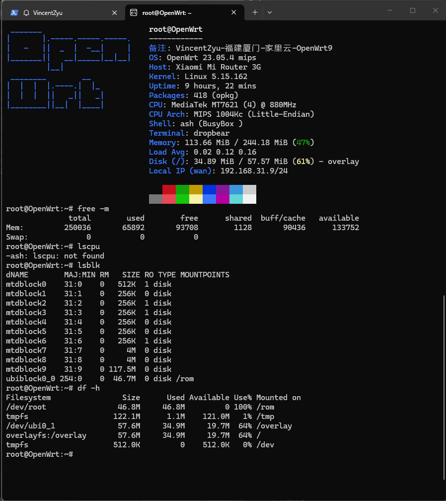

# 📊 LALT - luci-app-live-traffic

LALT（`luci-app-live-traffic`）是面向 OpenWrt 的轻量实时流量监控 LuCI 应用，按下挂设备展示上传、下载和最近 10 分钟走势。

## ✨ 功能

- WAN 实时上传、下载曲线。
- 按 MAC 聚合下挂客户端的实时速率与累计流量。
- 总览、设备矩阵和设置三个 LuCI 页面。
- 1、2、5、10 秒刷新间隔，默认 1 秒。
- 自动、低、中、高和超高五档浏览器 UI 质量，支持平滑曲线、数字补间与动态视觉效果。
- 历史仅保存在浏览器内存，不持续写入闪存。
- 检测 Flow Offloading 并警告，不修改防火墙配置。

## 🖼️ 界面预览

**实时流量总览**


**设备矩阵**



**设置**


## 🧪 开发测试环境

- 已测试 OpenWrt `23.05.4`、Linux `5.15.162` 和 `opkg`。
- 路由器型号：Xiaomi Mi Router 3G（小米路由器 R3G）。
- CPU：MediaTek MT7621，四线程，主频 `880 MHz`。
- CPU 架构：MIPS 1004Kc Little-Endian，对应 OpenWrt `ramips/mt7621`。
- 内存：约 `244 MiB`。
- 依赖 `nlbwmon` 与 `rpcd-mod-ucode`。

> **测试设备 Fastfetch 信息**
>
> 

硬件或软件 Flow Offloading 会使部分流量绕过 conntrack，因此逐设备统计可能低于实际值。

## 🚀 开发部署

确保 SSH 公钥登录可用，然后执行：

```powershell
python scripts/deploy.py deploy --host 192.168.1.1 --identity $env:USERPROFILE\.ssh\id_ed25519
```

路由器需要通过 `proxychains4` 下载软件包时增加 `--proxychains`。命令仅调用路由器已有配置，不包含代理地址。

部署前预览命令：

```powershell
python scripts/deploy.py deploy --host 192.168.1.1 --dry-run
```

卸载开发版本并恢复插件管理的 `nlbwmon` 刷新间隔：

```powershell
python scripts/deploy.py uninstall --host 192.168.1.1
```

## ⚙️ 安装后

进入 **状态 -> LALT -> 设置**，确认初始化后，插件会备份 `nlbwmon` 原刷新间隔并调整为选择的采样间隔。

流量数据范围仅包括经过本 OpenWrt 路由器转发的下挂客户端。它无法监控上游主路由的其他平级设备。

UI 质量偏好仅保存在当前浏览器中。图表和动画由客户端浏览器渲染，不会改变 `nlbwmon` 采样频率；自动档会保守选择低或中档，并在检测到持续慢帧时降级。

## 🧪 测试

```bash
node --test tests/core.test.mjs
node --check htdocs/luci-static/resources/live-traffic/core.js
```

真实路由器 WebUI 验收脚本使用 Python Playwright。配置优先级为：CLI 参数 > 当前进程环境变量 > `scripts/test/.env` > 内置默认值。先根据 `.env.example` 创建私有 `.env`，再创建虚拟环境并安装依赖：

```bash
uv venv tests/.venv
uv pip install --python tests/.venv -r scripts/test/requirements.txt
```

激活虚拟环境后，以下是 5 个常用示例：

```bash
# 默认检查 5 档质量、3 个页面和桌面/移动端，共生成 30 张截图
python scripts/test/webui_e2e.py

# 有头慢速运行，并在结束前保留浏览器 5 秒
python scripts/test/webui_e2e.py --headed --slow-mo-ms 250 --hold-seconds 5

# 仅检查总览页
python scripts/test/webui_e2e.py --url https://192.168.5.1 --page overview

# 仅检查桌面端超高质量模式
python scripts/test/webui_e2e.py --quality ultra --viewport desktop

# 从独立私密文件读取密码
python scripts/test/webui_e2e.py --password-file path/to/password.txt
```

截图和脱敏报告输出到被 Git 忽略的 `tmp/browser-debug/`；截图仍可能包含 IP、MAC 和设备名，请勿公开上传。

CI 的提交关键词、IPK 构建和 GitHub Release 规则见 [ci.md](.github/workflows/ci.md)。

## 📄 许可证

[Apache-2.0](LICENSE)
